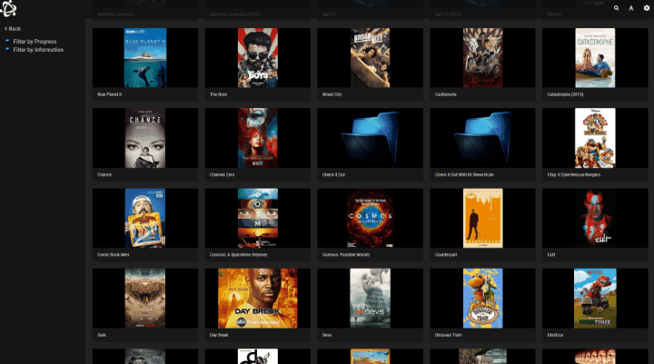

# Universal Media Server pour YunoHost

[](https://dash.yunohost.org/appci/app/ums)    
[](https://install-app.yunohost.org/?app=ums)

*[Read this readme in english.](./README.md)*
*[Lire ce readme en français.](./README_fr.md)*

> *Ce package vous permet d'installer Universal Media Server rapidement et simplement sur un serveur YunoHost.
Si vous n'avez pas YunoHost, regardez [ici](https://yunohost.org/#/install) pour savoir comment l'installer et en profiter.*

## Vue d'ensemble

Un Serveur Multimedia DLNA, UPnP et HTTP(S)

**Version incluse :** 10.9.0


## Captures d'écran



## Avertissements / informations importantes

### Configuration

Une fois installé, tous les réglages peuvent etre trouver dans `/ums/.config/UMS/`
Les réglages sont plutot bien documentés, vous pouvez les changer directement dans le fichier.
Le réglage par défaut utilisera le répertoire multimedia partagé (situé dans `/home/yunohost.multimedia/share`). Vous pouvez changer ce réglage dans le fichier `/home/ums/.config/UMS/UMS.conf` sur le réglage "folders".

### Limitations

 - pas de  multiinstance
 - fonctionne uniquement en sous-domaine (ums.mydomain.tld, et non mydomain.tld/ums)
 - pas de gestion d'utilisateur
 - Pas énormément testée
 
### Other infos

Si vous ne trouvez pas le serveur sur vos renderer, vous pouvez essayer les trucs suivants:
- Attendez un petit peu : lors du premier démarrage, UMS va indexer tous vos médias et ceci peut prendre un certain temps si vous en avez beaucoup
- Attendez encore un peu : le serveur s'annonce par un message ALIVE toutes les 30 sec, donc cela peut prendre tout ce temps avant qu'un renderer ne le trouve
- Vérifiez bien que le service ums tourne dans l'interface d'administration de yunohost
- Vérifiez sur quel interface réseau ums s'annonce. Vous pouvez trouver l'adresse utilisée et le réseau dans `/home/ums/.config/UMS/debug.log` ou `/var/log/ums/ums.log`. Cherchez une ligne ressemblant à `Using address /192.168.0.54 found on network interface: name:enp0s3 (enp0s3)`. Le sous-réseau utilisé doit être le même que le renderer (ie : si votre TV est sur 192.168.0.X et ums sur 192.168.1.X, cela ne marchera pas)

Sur de petits appareils (par exemple un raspberry), la transco peut demander trop de puissance, n'hésiter par à utiliser des transcodeur alternatifs.

## Documentations et ressources

* Site officiel de l'app : www.universalmediaserver.com
* Documentation officielle de l'admin : https://github.com/UniversalMediaServer/UniversalMediaServer/wiki
* Dépôt de code officiel de l'app : https://github.com/UniversalMediaServer
* Documentation YunoHost pour cette app : https://yunohost.org/app_ums
* Signaler un bug : https://github.com/YunoHost-Apps/ums_ynh/issues

## Informations pour les développeurs

Merci de faire vos pull request sur la [branche testing](https://github.com/YunoHost-Apps/ums_ynh/tree/testing).

Pour essayer la branche testing, procédez comme suit.
```
sudo yunohost app install https://github.com/YunoHost-Apps/ums_ynh/tree/testing --debug
ou
sudo yunohost app upgrade ums -u https://github.com/YunoHost-Apps/ums_ynh/tree/testing --debug
```

**Plus d'infos sur le packaging d'applications :** https://yunohost.org/packaging_apps